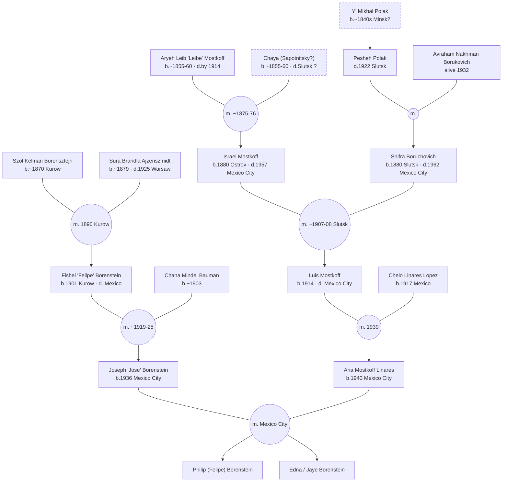
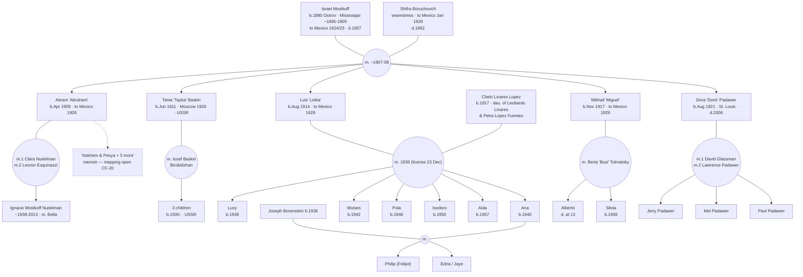
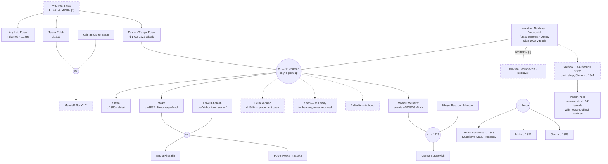

# Family Tree — Borenstein/Mostkoff/Polak

*Generated 2026-10-10 from `data/people.md` (all five extraction passes). Rendered natively by GitHub (Mermaid). Every node maps to a person ID in `data/people.md` — that file carries the citations and confidence marks; this one carries the shape.*

**Legend**

- Solid node/edge = established `[C]`/`[L]`; **dashed** = open `[?]` (placement, identification, or dates uncertain)
- `(("m. year"))` = marriage hub; children descend from the hub
- `d.` = died; `b.` = born; `~` = circa; `?` = uncertain

---

## 1 · The convergence — three lines, one family



## 2 · Line A — Borenstein (Kurow → Mexico City)

```mermaid
graph TD
    A01["Szol Kelman 'Saul Kalmon' Borensztejn<br/>b.~1870"] --- MA0102(("m. 1890, akta 4"))
    A02["Sura Brandla Ajzenszmidt<br/>b.~1879 · d.1925 Warsaw"] --- MA0102
    MA0102 --> A12["Chaim?<br/>b.1891?"]
    MA0102 --> A13["Cyrla?<br/>b.1892?"]
    MA0102 --> A03["Toibe 'Touba'<br/>b.1894 [C]"]
    MA0102 --> A14["Necha?<br/>b.1895?"]
    MA0102 --> A04["Rachmeil-Mendel 'Manuel Glatt'<br/>b.1897 [C]"]
    MA0102 --> A05["Fishel 'Felipe'<br/>b.1901 [C]"]
    A01 -.-> A06["'Tía Mania/Mane' Borenstein?<br/>likely sibling [?]"]

    A03 --- MA03M(("m. ~1933"))
    MITEL["Rachmeil Mitelhaus"] --- MA03M
    MA03M --> ANAM["Ana Mitelhaus<br/>b.1934 Warsaw? Mexico?"]
    MA03M --> JOSEM["Jose Mitelhaus<br/>b.1937 Mexico"]

    A04 --- MA0407(("m. 1915-22"))
    A07["Sophia/Sheindel Chanovesky<br/>alive 1966"] --- MA0407
    MA0407 --> A08["Angela Glatt = Angela Ringel<br/>b.1923 Bialystok"]
    A08 --- MA08R(("m. Ringel"))
    MA08R --> A09["Myrna Bilak<br/>1946-2001"]
    MA08R --> A10["Janette Epstein"]
    MA08R --> A11["Alfredo Ringel"]

    A05 --- MA0515(("m. ~1919-25"))
    A15["Chana Mindel Bauman<br/>b.~1903 (sis. Sura Ita)"] --- MA0515
    MA0515 --> A16["Enrique<br/>b.1926"]
    MA0515 --> A17["Sidney<br/>b.1927"]
    MA0515 --> A18["Joseph 'Jose'<br/>b.1936"]
    A17 ---|"m."| FINKLER["Rebecca Finkler"]

    style A12 stroke-dasharray:5 4
    style A13 stroke-dasharray:5 4
    style A14 stroke-dasharray:5 4
    style A06 stroke-dasharray:5 4
    style ANAM stroke-dasharray:5 4
    ```

*Not drawn: an unnamed son d. at birth 1942 (A05/Chana); Sidney is almost certainly the 'Sydney Borenstein Bauman' who certified Shifra's 1962 death certificate; Fishel's solo Arizona crossing May 1934 and the 1934/35 Warsaw trip — mysteries 1–2, see FAMILY-OVERVIEW.*

## 3 · Line B, elder generation — Leibe & Chaya's children

```mermaid
graph TD
    B01["Aryeh Leib 'Leibe' Mostkoff<br/>b.~1855-60 · d.by 1914"] --- MB0102(("m. ~1875-76"))
    B02["Chaya (Sapotnitsky?)<br/>village near Nesvizh · d.?"] --- MB0102
    MB0102 --> B08["Taiba 'eldest daughter'"]
    MB0102 --> B03["Morduckh 'Motl'<br/>b.~1877 Dvoretz"]
    MB0102 --> B06["Ginde / Hinde"]
    MB0102 --> B09["Lyubka"]
    MB0102 --> B04["Israel 'Isrol Leibovich'<br/>b.1880 Ostrov · d.1957 Mexico"]
    MB0102 --> B24["Etl"]
    MB0102 --> B05["Eiser 'Isodoro'<br/>b.1888 · d. Mississippi"]
    MB0102 -.-> B26["Dveira-Dora<br/>niece — which sibling? d.~1921 dysentery"]
    MB0102 -.-> MORE["…'and others'<br/>(memoir)"]

    B08 -.-> MB08T(("m. Tsukovich?"))
    MB08T --> B25["Isrol Tsukovich<br/>b.~1902-04"]

    B03 --- MB03D(("m. 1906 Lida"))
    DVORA["Dvora Portnoy<br/>of Radun"] --- MB03D
    MB03D --> GINDA["Ginda<br/>b.1907"]
    MB03D --> KHAIML["Khaim Leyb<br/>b.1909"]
    MB03D --> AVRAAM["Avraam<br/>b.1913"]

    B06 ---|"m. ?"| CHARCHES["____ Charches<br/>('Kharakh?' [?])"]

    B09 --> BRONYA["Bronya Barshay<br/>('Leybovna')"]
    B09 --> GRISHA["Grisha · Leningrad"]

    B24 --- MB24S(("m."))
    REZNIK["Samuil Reznik · Urechye station"] --- MB24S
    MB24S --> MASHA["Masha / Musya Reznik"]
    MB24S --> ANYAR["Anya Reznik"]

    B05 --- MB05A(("m."))
    ANNIE["Annie Frank"] --- MB05A
    MB05A --> B23["Louise Mostkoff<br/>Rosedale, MS"]
    B05 -.-> X11["Harold 'Skeeter' Mostkoff?<br/>b.~1918 Rosedale"]

    B07["Keili 'Clara?'"] -.-> MB07I(("m. Iskiwitz —<br/>Israel? Reuben? CF-12"))
    MB07I --> ISKIJ["Israel Iskiwitz<br/>m. Dora Bernstein · Memphis"]

    style B02 stroke-dasharray:5 4
    style B26 stroke-dasharray:5 4
    style MORE stroke-dasharray:5 4
    style CHARCHES stroke-dasharray:5 4
    style X11 stroke-dasharray:5 4
    style MB07I stroke-dasharray:5 4
```

*Israel & Shifra's descendants: next diagram. Candidate siblings X08 (Chaim Owzer Mostow, Vilnius), X09 (Movshe Mostkov), X15 (Samuel Mostkow) omitted — unconfirmed; see people.md.*

## 4 · Line B, descendants — Israel & Shifra (Slutsk → Mexico City; Tania in the USSR)



*Memoir's Jewish names for Luis's children (Shifra, Pesya, Lazaro, Ida) map uncertainly onto the civil names — CF-23.*

## 5 · Line C — Polak / Borukovich (Minsk/Slutsk)



---

## What this tree deliberately omits

- **The X-file candidates** (unconfirmed relatives): Chaim Owzer Mostow, Movshe Mostkov, Samuel Mostkow, the Bunin household (X01–X05), Harold Mostkoff, Abraham Borenstein 1906–1990, David & Lipke — all in `data/people.md` §X with their evidence.
- **Open conflicts** are drawn as dashed shapes, not resolved: CF-12 (Keili's husband), CF-13 (Beila's placement), CF-17 (Chaya's death), CF-20 (Abram's children), CF-23 (memoir vs. civil names).
- **Living people** appear by name only, no dates beyond what obituaries published.

*Regenerate/verify against `data/people.md` whenever the index changes; this file carries no citations of its own.*
